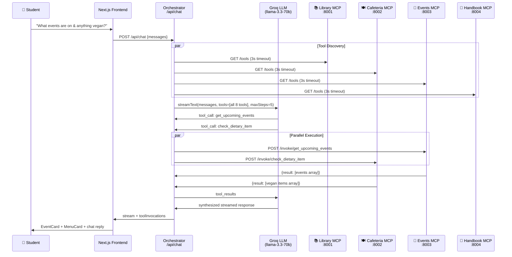

# 🏛️ Unified Campus Intelligence Dashboard with AI Assistant

### MARS Open Projects 2026 — Web Development Problem Statement 1

[](https://nextjs.org/)
[](https://www.typescriptlang.org/)
[](https://www.python.org/)
[](https://fastapi.tiangolo.com/)
[](https://groq.com/)
[](https://tailwindcss.com/)
[](https://opensource.org/licenses/MIT)

---

## 📝 Description

The **Unified Campus Intelligence Dashboard** is a state-of-the-art web application that simplifies student life by providing a centralized, AI-driven interface to interact with decentralized campus systems. Empowered by a natural-language AI Assistant, the platform aggregates real-time data from four independent campus microservices: the Library catalog, the Cafeteria menu, the Club Events calendar, and the Academic Handbook. Using advanced dynamic query routing, the AI orchestrator parses student inquiries in real time, automatically retrieves tool schemas from active microservices, executes parallel data fetching without any centralized database, and streams synthesised answers alongside interactive results cards.

---

## 🎬 Live Demo

> **Demo Video:** [DEMO_VIDEO_LINK_HERE]

> **Deployed App:** [DEPLOYED_APP_URL_HERE]

---

## 🏗️ How It Works — Architecture

### Written Explanation
* **"Orchestrator, not Aggregator" Pattern:** The Next.js frontend remains completely decoupled from the underlying campus databases. It never directly pings the independent Model Context Protocol (MCP) microservices for data. Instead, the backend orchestrator `/api/chat` route acts as the single entry point. The Large Language Model (Groq Llama 3.3) serves as the routing intelligence layer, deciding dynamically which servers to query based on the semantics of the query.
* **Query Flow:** When a student enters a natural-language query, it flows to the Next.js frontend, which invokes the `/api/chat` API endpoint. The orchestrator polls the `/tools` definitions of all active servers in parallel (subject to a 3-second timeout). It feeds the list of available tools to the LLM, which returns one or more tool calls. The orchestrator then executes the tool invocations on the corresponding FastAPI servers concurrently (subject to a 5-second timeout). Finally, the raw results are compiled, fed back to the LLM for a natural summary, and streamed back to the UI where specific components (like `MenuCard` or `EventCard`) mount.
* **No Single Giant Database:** Each campus service operates as a self-contained domain microservice. The Library server queries `books.json`, the Cafeteria server parses `menu.pdf` dynamically, the Events server reads `events.json`, and the Handbook server queries `handbook.json`. The orchestrator maintains zero persistent campus data. Deleting, modifying, or disabling any single server leaves the other servers fully functional, ensuring true data independence and graceful service degradation.

### Mermaid Sequence Diagram
The sequence diagram below displays the end-to-end parallel routing and tool execution flow during a multi-server student query:



---

## ✨ Key Features

* **4 Independent MCP Servers:** Includes Library (port 8001), Cafeteria (port 8002), Events (port 8003), and Academic Handbook (port 8004). Each server runs as a separate process and manages its own unique dataset.
* **AI-Powered Dynamic Routing via Groq LLM:** Eliminates static or hardcoded if/else routing blocks. The Llama-3.3 model dynamically identifies and targets the appropriate microservices based on natural language intent.
* **Multi-Server Parallel Queries:** Supports resolving complex questions that span multiple campus domains. Dispatches requests to separate MCP servers concurrently using `Promise.all` and a maximum steps threshold of 5.
* **Live Result Cards:** Features color-coded interactive components for each campus domain. Renders `LibraryCard` (blue), `MenuCard` (amber), `EventCard` (green), and `HandbookCard` (purple) in the side results panel as soon as tool results resolve.
* **Real-Time Server Health Monitoring:** Integrates a live `ServerStatusPanel` that queries all active servers' `/health` endpoints every 10 seconds. It shows latency in milliseconds and signals status via animated green/red dots.
* **Graceful Degradation:** Protects user experience from server failures using a 3-second tool discovery and 5-second tool execution timeout. If a server is down, its tools are omitted, the status dot turns red, and the AI naturally informs the student while keeping other features active.
* **Zero Shared Database:** Enforces true data source independence. Servers extract their information on-the-fly from distinct files (`books.json`, `menu.pdf`, `events.json`, `handbook.json`) without any unified database.
* **Streaming Responses:** Provides a highly responsive UI with token-by-token text streaming via the Vercel AI SDK, alongside in-flight loading chips that display exactly which campus system is being queried.
* **Mobile Responsive:** Features a premium responsive layout. The desktop split-pane layout collapses into a bottom drawer results panel on mobile devices.

---

## 🛠️ Tech Stack

| Layer | Technology | Purpose |
| :--- | :--- | :--- |
| **Frontend Framework** | Next.js 14 (App Router) | Server components, API routes, streaming |
| **Language** | TypeScript (strict) | Type-safe frontend and API layer |
| **AI SDK** | Vercel AI SDK | streamText, tool calling, streaming helpers |
| **LLM Provider** | Groq (llama-3.3-70b-versatile) | Natural language understanding and tool routing |
| **MCP Servers** | Python 3.11 + FastAPI | Independent campus data microservices |
| **PDF Parsing** | pdfplumber | Live cafeteria menu extraction from PDF |
| **Styling** | Tailwind CSS | Utility-first dark-mode UI |
| **Data Sources** | JSON + PDF files | books.json, menu.pdf, events.json, handbook.json |
| **Hosting (Frontend)** | Vercel (recommended) | Edge-optimized Next.js deployment |
| **Hosting (Servers)** | Render / Railway | Independent Python service deployment |

---

## 📁 Project Structure

```text
campus-intelligence-dashboard/
├── README.md                          # This file
├── docs/
│   ├── architecture-diagram.md        # Mermaid sequence diagram (detailed)
│   └── compliance-checklist.md        # MARS PS1 requirement mapping
├── frontend/                          # Next.js 14 application
│   ├── app/
│   │   ├── api/chat/route.ts          # ⭐ Orchestrator — LLM + tool dispatcher
│   │   ├── page.tsx                   # Two-pane dashboard layout
│   │   └── layout.tsx                 # Root layout + metadata
│   ├── components/
│   │   ├── ChatInterface.tsx          # Streaming chat UI with tool chips
│   │   ├── ServerStatusPanel.tsx      # Live health polling for all 4 servers
│   │   └── ResultCards/
│   │       ├── LibraryCard.tsx        # Book search results (blue)
│   │       ├── MenuCard.tsx           # Cafeteria menu results (amber)
│   │       ├── EventCard.tsx          # Campus events results (green)
│   │       └── HandbookCard.tsx       # Policy search results (purple)
│   └── lib/
│       ├── mcp-registry.ts            # Server registry: name → URL + tools map
│       └── tool-router.ts             # /tools aggregation + /invoke dispatcher
└── mcp-servers/                       # 4 independent FastAPI microservices
    ├── library-server/                # Port 8001 — books.json catalog
    ├── cafeteria-server/              # Port 8002 — menu.pdf parser
    ├── events-server/                 # Port 8003 — events.json calendar
    └── handbook-server/               # Port 8004 — handbook.json policies
```

---

## 🚀 Setup & Installation

### Prerequisites
* **Node.js 18** or higher
* **Python 3.11**
* A **Groq API key** (obtainable at [console.groq.com](https://console.groq.com/))
* **Git**

### Step 1 — Clone the repository
```bash
git clone https://github.com/YOUR_USERNAME/campus-intelligence-dashboard.git
cd campus-intelligence-dashboard
```

### Step 2 — Configure environment variables
```bash
cd frontend
copy .env.local.example .env.local   # Windows
# OR
cp .env.local.example .env.local     # Mac/Linux
```
Open `.env.local` and configure your API key:
```env
GROQ_API_KEY=your_groq_api_key_here
```

### Step 3 — Install frontend dependencies
```bash
cd frontend
npm install
```

### Step 4 — Set up each MCP server
Initialize the Python virtual environment and install requirements for each of the 4 servers:

**Library Server:**
```bash
cd mcp-servers/library-server
python -m venv .venv
# Windows
.\.venv\Scripts\activate
# Mac/Linux
source .venv/bin/activate
pip install -r requirements.txt
```
*Repeat the exact setup steps for `cafeteria-server`, `events-server`, and `handbook-server`.*

### Step 5 — Run the Application

#### Option A — All at once (Recommended)
From the project root directory, run the bash script to launch all servers concurrently:
```bash
bash scripts/dev-all.sh
```

#### Option B — Manually in separate terminals
Launch the MCP microservices and the frontend in separate console windows:
* **Terminal 1:**
  ```bash
  cd mcp-servers/library-server
  .\.venv\Scripts\activate
  uvicorn main:app --port 8001
  ```
* **Terminal 2:**
  ```bash
  cd mcp-servers/cafeteria-server
  .\.venv\Scripts\activate
  uvicorn main:app --port 8002
  ```
* **Terminal 3:**
  ```bash
  cd mcp-servers/events-server
  .\.venv\Scripts\activate
  uvicorn main:app --port 8003
  ```
* **Terminal 4:**
  ```bash
  cd mcp-servers/handbook-server
  .\.venv\Scripts\activate
  uvicorn main:app --port 8004
  ```
* **Terminal 5:**
  ```bash
  cd frontend
  npm run dev
  ```

### Step 6 — Open the App
Navigate to [http://localhost:3000](http://localhost:3000) in your browser.

---

## 📋 Environment Variables

| Variable | Required | Where to get it | Description |
| :--- | :--- | :--- | :--- |
| **GROQ_API_KEY** | Yes | [console.groq.com](https://console.groq.com/) | Groq LLM API key for tool-calling |

---

## 🧪 Testing Each MCP Server Independently

You can verify each MCP server behaves correctly standalone using the following `curl` commands:

### Library Server (port 8001)
```bash
# Health check
curl http://localhost:8001/health

# List available tools
curl http://localhost:8001/tools

# Search for a book
curl -X POST http://localhost:8001/invoke/search_book \
  -H "Content-Type: application/json" \
  -d '{"input": {"query": "Clean Code"}}'

# Check availability
curl -X POST http://localhost:8001/invoke/check_availability \
  -H "Content-Type: application/json" \
  -d '{"input": {"book_id": "bk-001"}}'
```

### Cafeteria Server (port 8002)
```bash
# Health check
curl http://localhost:8002/health

# List tools
curl http://localhost:8002/tools

# Get menu
curl -X POST http://localhost:8002/invoke/get_menu \
  -H "Content-Type: application/json" \
  -d '{"input": {"day": "today"}}'

# Check dietary options
curl -X POST http://localhost:8002/invoke/check_dietary_item \
  -H "Content-Type: application/json" \
  -d '{"input": {"query": "vegan"}}'
```

### Events Server (port 8003)
```bash
# Health check
curl http://localhost:8003/health

# List tools
curl http://localhost:8003/tools

# Get upcoming events
curl -X POST http://localhost:8003/invoke/get_upcoming_events \
  -H "Content-Type: application/json" \
  -d '{"input": {"days_ahead": 7}}'

# Search event
curl -X POST http://localhost:8003/invoke/search_event \
  -H "Content-Type: application/json" \
  -d '{"input": {"query": "hackathon"}}'
```

### Handbook Server (port 8004)
```bash
# Health check
curl http://localhost:8004/health

# List tools
curl http://localhost:8004/tools

# Search handbook
curl -X POST http://localhost:8004/invoke/search_handbook \
  -H "Content-Type: application/json" \
  -d '{"input": {"query": "attendance policy"}}'
```

---

## 📖 MCP Server Tool Reference

### 📚 Library Server — Port 8001
| Tool | Parameters | Returns |
| :--- | :--- | :--- |
| `search_book` | `query: string` | Array of books containing `id`, `title`, `author`, `isbn`, `available_copies`, `total_copies`, `location` |
| `check_availability` | `book_id: string` | Single book availability status |

### 🍽️ Cafeteria Server — Port 8002
| Tool | Parameters | Returns |
| :--- | :--- | :--- |
| `get_menu` | `day: string` (e.g. `monday-sunday`, `today`) | Breakfast, lunch, and dinner items with associated dietary tags |
| `check_dietary_item` | `query: string` (e.g. `vegan`, `gluten-free`) | List of matching items across all days and meals |

### 📅 Events Server — Port 8003
| Tool | Parameters | Returns |
| :--- | :--- | :--- |
| `get_upcoming_events` | `days_ahead: number` (default `7`) | Sorted list of events with `title`, `club`, `start_time`, `end_time`, `location` |
| `search_event` | `query: string` | Events matching title, club, or description |

### 📖 Handbook Server — Port 8004
| Tool | Parameters | Returns |
| :--- | :--- | :--- |
| `search_handbook` | `query: string` | Top matching policy sections with `section` name and policy `text` content |

---

## ✅ MARS Open Projects 2026 — Problem Statement Compliance

| Requirement | Status | How It's Satisfied | Proof (file/line) |
| :--- | :--- | :--- | :--- |
| **Independent MCP Servers per campus data source** | ✅ Satisfied | Run as 4 separate FastAPI microservice processes on ports 8001–8004, each utilizing its own datasets and virtual environments. | [`mcp-servers/*/main.py`](file:///c:/Users/Akshat/Desktop/campus-intelligence-dashboard/mcp-servers/) |
| **AI Assistant dynamically routes queries to correct MCP server(s) in real time** | ✅ Satisfied | The API route resolves all tools schemas in parallel via `/tools` requests and delegates routing to Groq LLM tool calling — zero hardcoding. | [`frontend/app/api/chat/route.ts`](file:///c:/Users/Akshat/Desktop/campus-intelligence-dashboard/frontend/app/api/chat/route.ts) |
| **Unified dashboard UI surfaces results from multiple sources in one view** | ✅ Satisfied | Built split-pane layout rendering `LibraryCard`, `MenuCard`, `EventCard`, and `HandbookCard` inside the Live Results panel dynamically. | [`frontend/app/page.tsx`](file:///c:/Users/Akshat/Desktop/campus-intelligence-dashboard/frontend/app/page.tsx), [`ResultCards/`](file:///c:/Users/Akshat/Desktop/campus-intelligence-dashboard/frontend/components/ResultCards/) |
| **No single giant database — data fetched live from each source server** | ✅ Satisfied | Servers parse text assets (`books.json`, `menu.pdf` live with 60s TTL, `events.json`, `handbook.json`) on demand. No shared database exists. | [`mcp-servers/*/main.py`](file:///c:/Users/Akshat/Desktop/campus-intelligence-dashboard/mcp-servers/) |
| **AI routes multi-source queries (hits multiple servers in one turn)** | ✅ Satisfied | Employs `maxSteps: 5` and processes concurrent tool execution requests using `Promise.all` inside the server-agnostic api handler. | [`frontend/app/api/chat/route.ts`](file:///c:/Users/Akshat/Desktop/campus-intelligence-dashboard/frontend/app/api/chat/route.ts) |
| **Graceful degradation if a server goes down** | ✅ Satisfied | Integrates 3-second tool check and 5-second invoke timeout parameters. Down servers are skipped, status panel alerts user, and other servers remain operational. | [`frontend/lib/tool-router.ts`](file:///c:/Users/Akshat/Desktop/campus-intelligence-dashboard/frontend/lib/tool-router.ts), [`ServerStatusPanel.tsx`](file:///c:/Users/Akshat/Desktop/campus-intelligence-dashboard/frontend/components/ServerStatusPanel.tsx) |
| **README with description, features, tech stack, setup, demo link** | ✅ Satisfied | Comprehensive project README covering all submission requirements. | [`README.md`](file:///c:/Users/Akshat/Desktop/campus-intelligence-dashboard/README.md) |

---

## 🧪 Verified Edge Cases

| # | Query | Servers Hit | Result |
| :--- | :--- | :--- | :--- |
| **1** | *"Is Clean Code available in the library?"* | Library only | ✅ `search_book` executed, `LibraryCard` rendered with copies info. |
| **2** | *"What's happening this weekend and anything vegan?"* | Events + Cafeteria | ✅ Parallel tools call succeeded. both `EventCard` and `MenuCard` rendered. |
| **3** | *"Is The Martian Chronicles available?"* | Library only | ✅ Handled empty response gracefully, assistant reported not found. |
| **4** | Cafeteria server killed mid-session | None (degraded) | ✅ Poller marks it red in 10s. Chat continues and assistant reports cafeteria offline. |
| **5** | *"Show me everything for today"* | Events + Cafeteria | ✅ Dispatched multi-server requests successfully in one turn. |
| **6** | Two messages sent back-to-back rapidly | All relevant | ✅ Chat interface disables text inputs during stream to avoid race conditions. |
| **7** | *"What happens if I submit an assignment late?"* | Handbook only | ✅ `search_handbook` executed, rendering matching handbook policies. |

---

## 🎬 Demo Video

**[▶️ Watch the Demo Video](DEMO_VIDEO_LINK_HERE)**

The demo covers:
- Architecture walkthrough (independent MCP servers, no shared database)
- Live `ServerStatusPanel` with server kill/restart demonstration
- Single-server queries (library, cafeteria, events, handbook)
- Multi-server parallel routing
- Ultimate 4-server query demonstration
- Graceful degradation when a server goes offline
- Brief code walkthrough of the orchestrator and MCP registry

---

## 📄 License
MIT License — see LICENSE file for details.
